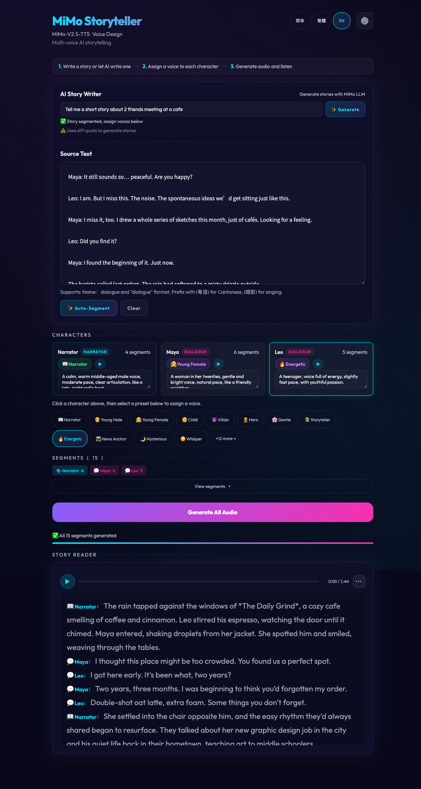
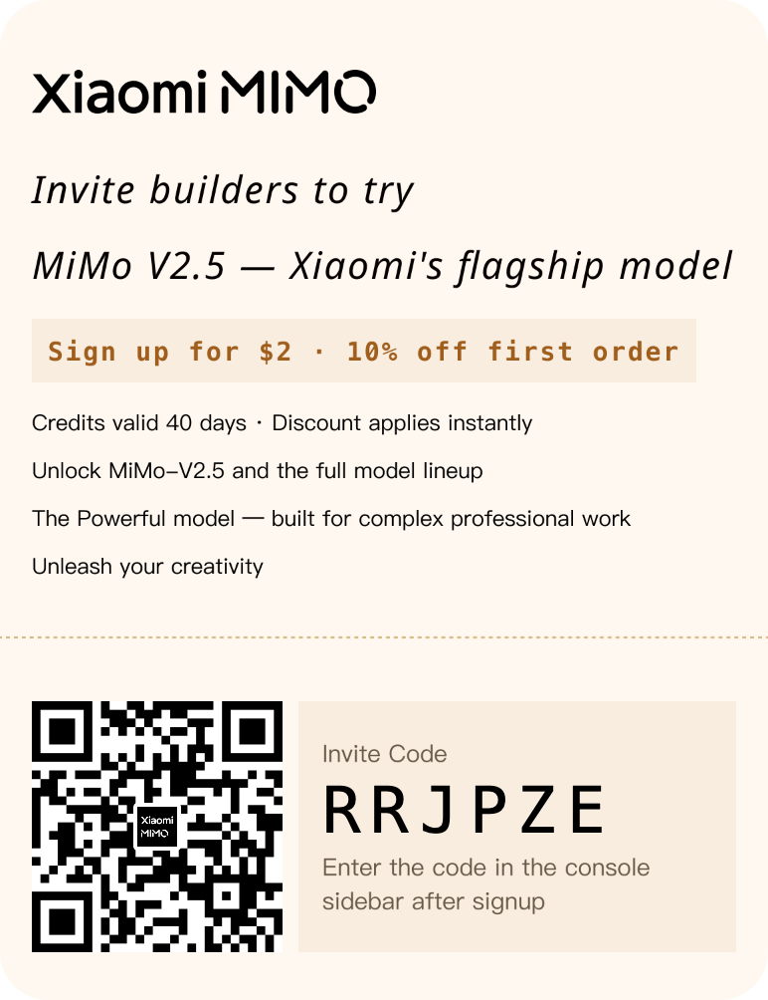

# 🎙️ MiMo Storyteller

[](LICENSE)
[](https://wsamuelw.github.io/mimo-storyteller/)

**English** | [简体中文](README-zh-CN.md) | [繁體中文](README-zh-TW.md)

MiMo-V2.5 TTS is free for a limited time — so I built a multi-character storyteller. Generate a story, voices are auto-assigned, and text highlights as it plays. Zero backend, zero cost.



### Get Free API Credits

Sign up at [platform.xiaomimimo.com](https://platform.xiaomimimo.com) with invite code **RRJPZE** — get $2 in free credits plus 10% off your first order.

- Credits valid 40 days · Discount applies instantly
- Unlock MiMo-V2.5 and the full model lineup



---

## Quick Start

1. Open `index.html` in a browser (or visit the [live demo](https://wsamuelw.github.io/mimo-storyteller/))
2. Click ⚙️ Settings and paste your MiMo API key
3. Write a story (or click ✨ to generate one with AI)
4. Assign voices to characters in the character cards
5. Click Generate and listen

## How It Works

MiMo Storyteller uses Xiaomi's [MiMo-V2.5-TTS](https://platform.xiaomimimo.com) API to turn text into multi-character audio narration:

- **Text segmentation** auto-detects characters from `Name：dialogue` and `"dialogue"` formats
- **Voice design** lets you describe any voice in natural language (e.g. "a warm middle-aged male voice")
- **Parallel TTS generation** creates audio for all segments simultaneously
- **Karaoke highlighting** displays text character-by-character as it plays

## Features

### Core
- **3-pattern text segmentation** — auto-detects characters from `Name：dialogue` and `"dialogue"` formats
- **24 voice presets** — one-click voice assignment in 3 languages (12 visible, +12 more expandable)
- **Voice design** — type any voice description in natural language
- **Voice preview** — ▶ button on each character card to hear the voice before generating
- **AI story generator** — prompt → LLM story → auto-segment → assign voices → TTS
- **Dialect & singing** — prefix text with `(粤语)` or `(唱歌)` to switch voice mode
- **Retry failed segments** — regenerate only the segments that failed

### Playback
- **Parallel generation** — 3 segments simultaneously (3× faster)
- **Sequential playback** — play all segments in order with gap handling
- **Karaoke highlighting** — character-by-character text highlighting during playback
- **Minimal top bar** — play/pause + progress + time, always visible
- **Dropdown menu** — speed, volume, prev/next, download all, share (⋯ button)

### UX
- **3-language support** — 简体中文, 繁體中文, English
- **Toast notifications** — dismissible, errors stay until clicked
- **Step indicators** — ① Text → ② Characters → ③ Story Reader
- **Settings modal** — API key, endpoint, custom URL, proxy (with focus trap)
- **API key toggle** — eye icon to show/hide password
- **Clear confirmation** — warns before destroying all work
- **Voice preset badges** — shows selected voice in character cards
- **Collapsed segment list** — summary chips with speaker counts, expandable on demand

### Mobile
- **44px touch targets** — meets Apple/Google guidelines on all interactive elements
- **Responsive grid** — single column on mobile, multi-column on desktop
- **Safe-area padding** — modal footer respects iPhone home indicator

### Accessibility
- **Focus trap** — modal traps Tab/Shift+Tab, returns focus on close
- **ARIA labels** — all form inputs, buttons, and dynamic content labeled
- **aria-live regions** — progress, segment count, story status announced to screen readers
- **prefers-reduced-motion** — all animations disabled for users who opt out
- **Keyboard navigation** — all interactive elements reachable via keyboard

---

## Code Structure

```
├── index.html          # App structure
├── style.css           # Neon glass design system
├── app.js              # Core logic (segmentation, TTS, playback)
├── i18n.js             # 3-language translations (~148 keys each)
└── API.md              # API integration details
```

### app.js — Core Logic

| Section | Purpose |
|---------|---------|
| State | Global state object (segments, characters, audio buffers) |
| PRESETS | 24 voice descriptions × 3 languages |
| escapeHtml | XSS protection for innerHTML |
| Toast | Notification system (errors stay until clicked) |
| segmentText | 3-pattern text segmentation engine |
| buildCharacters | Extract characters from segments |
| renderStep2 | Character cards + segment list UI |
| renderStoryReader | Karaoke-style text display with character highlighting |
| generateAll | Parallel TTS generation with retry |
| retryFailed | Re-generate only failed segments |
| callTTS | MiMo API integration |
| togglePlayPause | Play/pause with icon swap |
| playAll/stopAll | Sequential playback with gap handling |
| togglePlayerMenu | Dropdown menu for speed, volume, actions |
| setPlaybackSpeed | Speed control (0.75x–2x) |
| setVolume/toggleMute | Volume control |
| seekProgress | Click-to-seek on progress bar |
| renderSegmentsList | Collapsed segment list with summary chips |
| generateStory | AI story generation via MiMo LLM |
| openSettings/closeSettings | Modal with focus trap |

### i18n.js — Translations

| Section | Purpose |
|---------|---------|
| I18N object | 3 locale keys (zh-CN, zh-TW, en) with ~148 keys each |
| t() function | Translation lookup with fallback chain |
| setLang() | Updates DOM, `document.title`, `document.documentElement.lang` |
| data-i18n | Auto-translates text content on language switch |
| data-i18n-aria | Auto-translates aria-label attributes |
| data-i18n-placeholder | Auto-translates placeholder attributes |

### Text Segmentation — 3 Patterns

```
Pattern 1: Name：dialogue     → speaker = Name
Pattern 2: "dialogue"         → speaker = last speaker
Pattern 3: anything else      → narration
```

**Scene markers** (`【第三章】`, `---`, `***`) are skipped.

---

## Voice Presets

24 built-in voice presets across 3 categories, available in all 3 languages:

- **Narration** — narrator, storyteller, news anchor, mysterious, whisper
- **Characters** — young male/female, child, hero, villain, gentle, energetic
- **Anime** — tsundere, yandere, onee-san, kuudere, ojou-sama, flirty, seductive, domina

Full descriptions in [`i18n.js`](i18n.js).

---

## Deployment

### GitHub Pages
1. Push to a GitHub repository
2. Go to **Settings → Pages → Deploy from branch** (main)
3. Your app is live at `https://username.github.io/repo-name`

### Environment
- **No build step** — pure HTML/CSS/JS
- **No server** — runs entirely in the browser
- **No dependencies** — zero npm packages
- **API key** — stored in each user's localStorage (per-origin)

---

## Browser Support

Supports Chrome 66+, Firefox 57+, Safari 12.1+, and Edge 79+. IE11 is not supported.

---

## Security

- **API key** stored in `localStorage` (plaintext, per-origin)
- **XSS protection** via `escapeHtml()` on all user input
- **CORS** — MiMo API returns `Access-Control-Allow-Origin: *`
- **No tracking** — zero analytics, zero cookies, zero external services
- See [SECURITY.md](SECURITY.md) for vulnerability reporting

---

## Known Limitations

1. **Segmentation** — Only handles `Name：dialogue` and `"dialogue"` formats. Complex dialogue with inline narration between quotes may misassign speakers.
2. **Audio format** — Outputs WAV only. No MP3/OGG compression.
3. **Max segments** — No hard limit, but 50+ segments take several minutes to generate.
4. **LLM prompt** — Story generation prompt is in Chinese. English stories may have lower quality.

---

## Contributing

See [CONTRIBUTING.md](CONTRIBUTING.md) for setup, conventions, and PR process.

See [CODE_OF_CONDUCT.md](CODE_OF_CONDUCT.md) for community guidelines.

---

## License

MIT — use freely, no attribution required. See [LICENSE](LICENSE).

---

## Acknowledgments

- [MiMo-V2.5-TTS](https://platform.xiaomimimo.com) — Xiaomi's voice synthesis API
- [Outfit](https://fonts.google.com/specimen/Outfit) — UI typography
- [Noto Sans SC](https://fonts.google.com/noto/specimen/Noto+Sans+SC) — Chinese typography
